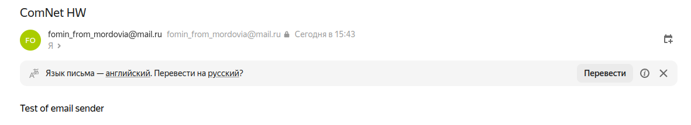
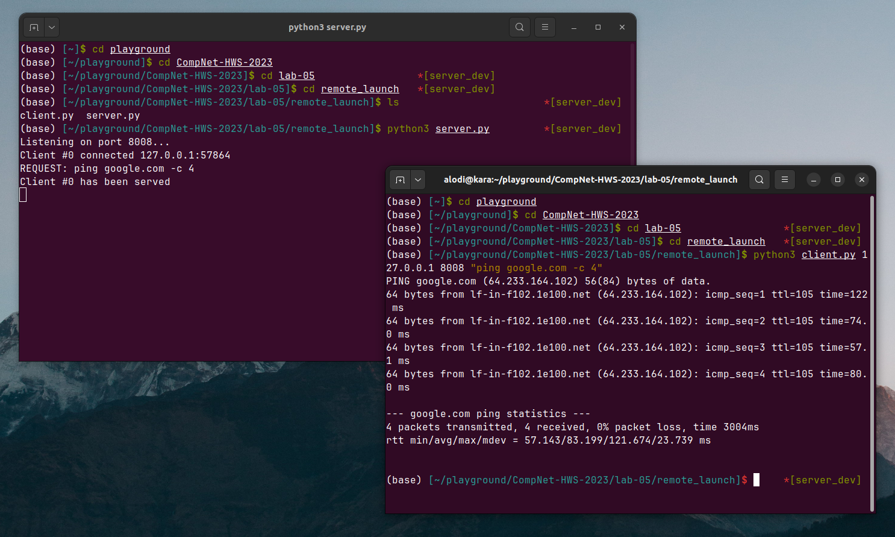

# Практика 5. Прикладной уровень

## Программирование сокетов. 

### 1.1 Почта и SMTP (2 балла)

Почта действительно отправляется: 


### 2. Удаленный запуск команд (3 балла) 
За основу возьмём уже написанный в 3 лабораторной работе сервер и перепишем функцию `handle_request`:
```python
def handle_request(self, request):
        program_call = request.split()
        prog_name = program_call[0]

        try:
            proc = subprocess.Popen(program_call, stdout=subprocess.PIPE)
        except FileNotFoundError:
            return f"Error: {prog_name} not found"

        response_body = ""
        start_time = time.monotonic()
        time_limit = 30.0

        while True:
            try:
                output = proc.stdout.readline()
            except subprocess.TimeoutExpired:
                if time.monotonic() - start_time >= time_limit:
                    response_body += "EXIT: process execution time exceeded."
                    proc.kill()
                    break
            else:
                if not output:
                    break
                response_body += output.decode("utf-8")
        proc.kill()
        return response_body
```
Сервер запускает новый процесс, на выполнение которого отведено 30 секунд. Если процесс не успевает закончить работу, то ему посылается SIGKILL.

Демонстрация работы связки клиент/сервер на примере вызова программы `ping`:




