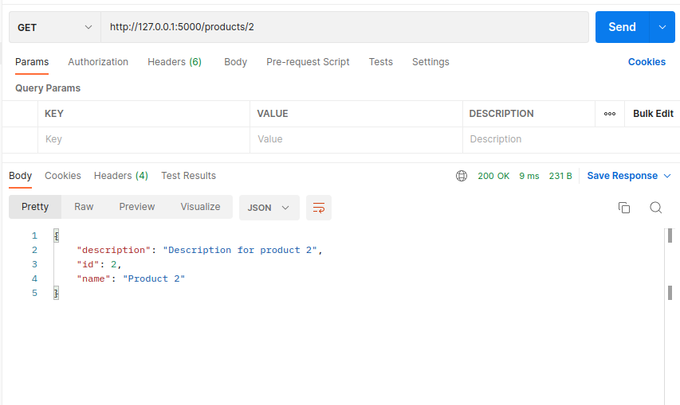

# Практика 2. Rest Service
## Выполнил Никита Фомин Б-06

### Программирование. Rest Service.

### Задание А

Для написания REST приложения я использовал язык `Python` и фреймворк `Flask`. В приложении реализованы все требуемые операции, но есть несколько недостатков - список товаров хранится в оперативной памяти и при перезапуске сервера информация об изменениях теряется; для поиска товара по id приходится переберать список всех товаров, что очень затратно по времени; другие проблемы связанные с id;

```python
from flask import Flask, jsonify, request, send_file
from uuid import uuid4
import os


app = Flask(__name__)

ICONS_FOLDER = os.path.join(os.getcwd(), 'icons')
app.config['ICONS_FOLDER'] = ICONS_FOLDER


# список продуктов в оперативной памяти
products = [
    {"id": 1, "name": "Product 1", "description": "Description for product 1", "icon": "1.jpg"},
    {"id": 2, "name": "Product 2", "description": "Description for product 2", "icon": "2.jpg"}
]

def id_generator():
    num = len(products)
    while True:
        num += 1
        yield num

free_id = id_generator()


@app.route('/products/list', methods=['GET'])
def get_products_list():
    return jsonify(products)

@app.route('/products/<int:id>', methods=['GET'])
def get_product(id):
    for product in products:
        if product['id'] == id:
            return jsonify(product), 200
    return jsonify({'error': 'Product not found'}), 400

@app.route('/products/<int:id>/get-icon', methods=['GET'])
def get_product_icon(id):
    for product in products:
        if product['id'] == id:
            image_path = os.path.join(ICONS_FOLDER, product['icon'])
            if os.path.exists(image_path):
                return send_file(image_path, mimetype='image/png'), 200
    return jsonify({'error': 'Product not found'}), 200


#TODO узнать как можно одним запросом устанавливать и название и описание и картинку.
@app.route('/products', methods=['POST'])
def add_product():
    request_data = request.get_json()
    if 'name' not in request_data or 'description' not in request_data:
        return jsonify({'error': 'Product must have a name and description'})
    product = {
        'id': next(free_id),
        'name': request_data['name'],
        'description': request_data['description'],
        'icon': request_data.get('icon', 'blank.png')
    }
    products.append(product)
    return jsonify({'message': f'Product added successfully. New product Id: {product["id"]}'})


@app.route('/products/<int:id>/set-icon', methods=['PUT'])
def set_product_icon(id):
    for product in products:
        if product['id'] == id:
            if 'icon' not in request.files:
                return jsonify({'error': 'File is missing'}), 400
            icon_file = request.files['icon']
            if icon_file.filename == '':
                return jsonify({'error': 'No selected icon file.'}), 400
            icon_path = os.path.join(app.config['ICONS_FOLDER'], icon_file.filename)
            icon_file.save(icon_path)
            product['icon'] = icon_file.filename
            return jsonify({'message': 'Product updated successfully'}), 200
    return jsonify({'error': 'Product not found'}), 400


@app.route('/products/<int:id>', methods=['PUT'])
def update_product(id):
    for product in products:
        if product['id'] == id:
            if "name" in request.json:
                product['name'] = request.json['name']
            if "description":
                product['description'] = request.json['description']
            return jsonify({'message': 'Product updated successfully'}), 200
    return jsonify({'error': 'Product not found'}), 400


@app.route('/products/<int:id>', methods=['DELETE'])
def delete_product(id):
    for product in products:
        if product['id'] == id:
            products.remove(product)
            return jsonify({'message': 'Product deleted successfully'}), 200
    return jsonify({'error': 'Product not found'}), 400


if __name__ == '__main__':
    if not os.path.exists(ICONS_FOLDER):
        os.mkdir(ICONS_FOLDER)
    app.run(debug=True)
```

### Задание Б

1. GET запрос в `/products/list` - список товаров:


2. GET запрос в `/products/2` - товар с конкретным id:


3. POST запрос в `/products` - добавляем новый товар:


4. PUT запрос в `/products/1` - обновляем данные товара:


5. DELETE зарос в `products/1` - удаляем товар:


### Задание В
Я дополнил дополнил функцию `add_product` и написал две новые функции: `get_product_icon` и `set_product_icon`. Я хотел сделать так, чтобы можно было добавлять иконку сразу при создании товара, но так и не понял как это сделать. Занём это в планы на будущее, так что в следующих версиях это будет реализовано. К тому же дописал проверки в некоторых функциях. 

## Планы на будущее
1. Нормальные id с поиском товара за O(1).
2. POST запрос, включащий в себя название, описание и картинку вместе.
3. Написание автотестов
