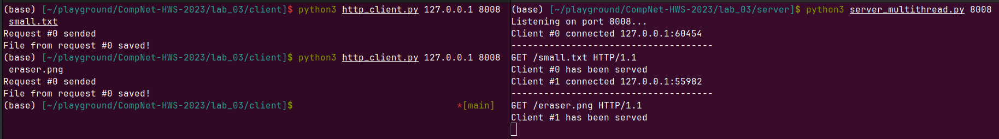

# Практика 3. Прикладной уровень
## Выполнил Никита Фомин Б-06

### Программирование сокетов. Веб-сервер 

### А. Однопоточный веб-сервер 

Сервер написан на python, с использованием библиотеки `socket`. Вот получившийся код:

```py
import socket
import os

HOST = "127.0.0.1"
PORT = 8008
LOCAL_STORAGE_PATH = os.path.join(os.getcwd(), 'localfiles')

server_socket = socket.socket(socket.AF_INET, socket.SOCK_STREAM)
server_socket.bind((HOST, PORT))
server_socket.listen(1) 
print('Listening on port 8008..')

while True:
    client_socket, address = server_socket.accept()
    request = client_socket.recv(1024).decode()

    requested_file_path = os.path.join(LOCAL_STORAGE_PATH, request.split()[1][1:]) 

    if os.path.exists(os.path.join(requested_file_path)):
        with open(requested_file_path, 'rb') as file:
            file_content = file.read()
        response = 'HTTP/1.1 200 OK\n\n'.encode() + file_content
    else:
        response = 'HTTP/1.1 404 Not Found\n\nFile not found'

    client_socket.sendall(response)
    client_socket.close()
    print(f"user {address[0]} was served")

```

Файлы, которые могут быть возвращены пользователю, лежат в дирректории `./server/localfiles/`. Для тестировки туда помещены несколько картинок, txt и html документы.

Попробуем запросить у сервера картинку, запустив наш сервер и введя в браузере запрос:

Запуск сервера:
```
$ python3 server.py                                                                                     
Listening on port 8008..
```
Запрос в браузере:
```
http://127.0.0.1:8008/earth.jpg
```
Результат:


### Б. Многопоточный веб-сервер + Г. Ограничение потоков сервера
Многопоточность сервера реализована в следующих строчках:

```py
import threading


@click.command()
@click.argument('port', required=False, default=8008)
@click.option('conc_level', '-c', '--concurrencyLevel', required=False, default=10, type=int)
def run_server(port, conc_level):
    serv_sock = create_serv_sock(port)
    semaphore = threading.Semaphore(conc_level)
    cid = 0
    while True:
        client_sock = accept_client_conn(serv_sock, cid)
        semaphore.acquire()
        t = threading.Thread(target=serve_client,
                             args=(client_sock, cid, semaphore))
        t.start()
        cid += 1


def serve_client(client_sock, cid, semaphore):
    .
    .
    .
    semaphore.release()
```

Т.е потоки создаются через `threading.Thread(target=serve_client, args=(client_sock, cid, semaphore))`, а ограничение их кол-ва регулируется через семафор: `semaphore = threading.Semaphore(conc_level)`.

Какого-то адекватного способа демонстрации мультипоточности процесса я не нашел. Локально тестировал сервер с concLevel = 2, time.sleep(15) и запускал три клиента. Всё работало именно так, как и задумывалось - третий клиент вставал в очередь, а двое первых обслуживались параллельно. 

### В. Клиент

Пример запуска клиента:
```
$ python3 http_client.py 127.0.0.1 8008 helloworld.txt
```
После скачивания файла клиент завершает свою работу. В планах написать клиент, который сможет обрабатывать несколько запросов подряд.

Вот пример взаимодействия клиента и сервера:

