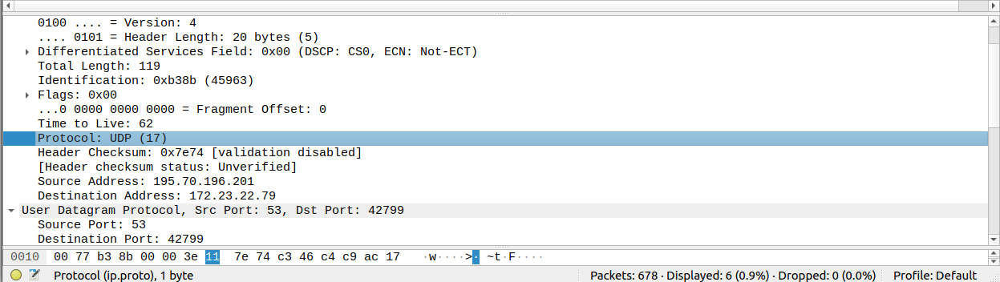

# Практика 6. Транспортный уровень

## 1. Wireshark: UDP 

Начнём захват пакетов в Wireshark. Немного посёрфим в интернете, тем самым набьём  несколько UDP-пакетов. Рассмотрим один из них:  

### Сколько полей содержит UDPзаголовок
Как видим на скриншоте, UDP-заголовок состоит из 4 полей:

1. Поле исходного порта (Source Port), которое указывает на порт, с которого отправляется пакет.   
2. Поле порта назначения (Destination Port), которое указывает на порт, на который отправляется пакет.   
3. Поле длины (Length), которое указывает на общую длину пакета (заголовок UDP + данные) в байтах.   
4. Поле контрольной суммы (Checksum). Как узнаём из Википедии, она используется для обеспечения целостности данных в пакете. Контрольная сумма UDP вычисляется на основе всего пакета (заголовок UDP + данные) и помещается в это поле.

### Определите длину (в байтах) для каждого поля UDP-заголовка, обращаясь к отображаемой информации о содержимом полей в данном пакете. 
Общая длина заголовка UDP составляет 8 байт. Выбирая каждый отдельный заголовок, узнаём, что у них **одинаковая длина - 2 байта**. 

### Значение в поле Length (Длина) – это длина чего?
Значение в поле Length (Длина) это **общая длина пакета в байтах, включая заголовок UDP и данные**. Это значение включает в себя длину заголовка UDP, которая составляет 8 байт, а также длину данных, передаваемых в пакете.   
Выделив DNS часть нашего пакета, узнаём, что она составляет 91 байт и всё сходится: 99 = 91(DNS) + 8(UDP)

### Какое максимальное количество байт может быть включено в полезную нагрузку UDP-пакета? 
Максимальный размер полезной нагрузки UDP-пакета будет равен максимальному размеру пакета (2**16 - 1) минус размер заголовка UDP (8 байт, как узнали раннее). В результате получаем **65 527 байт**.

### Чему равно максимально возможное значение номера порта отправителя?
Т.к поле порта назначения занимает 2 байта, то максимальное возможное значение 2^16 - 1 = **65535**

### Какой номер протокола для протокола UDP? Дайте ответ и для шестнадцатеричной и десятеричной системы?
Перейдя к IP-дейтаграмме, видим, что протокол UDP имеет номер **17 (или же 0x11)**

### Проверьте UDP-пакет и ответный UDP-пакет, отправляемый вашим хостом. Определите отношение между номерами портов в двух пакетах. 

Первый пакет:  
Source Port: 42799  
Destination Port: 53  

Ответный пает:  
Source Port: 53  
Destination Port: 42799  

Destination port ответного пакета равен Source port первого пакета.  