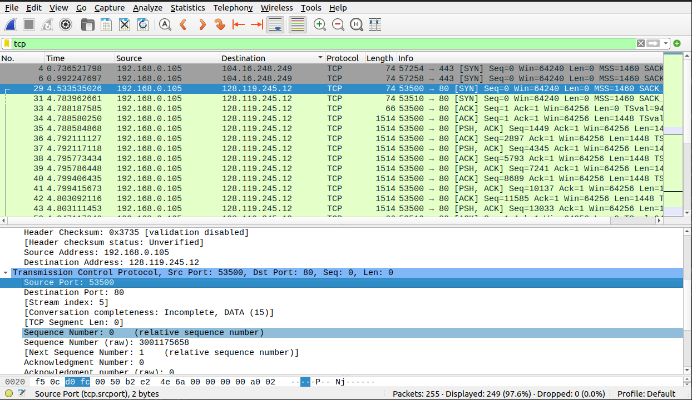
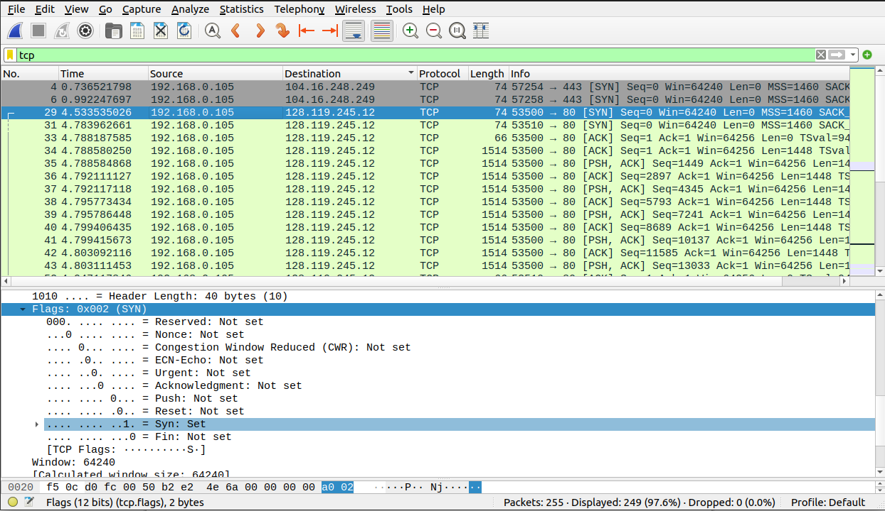
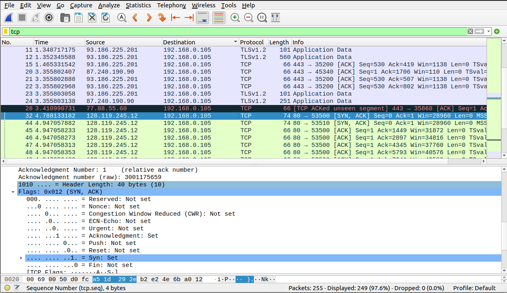
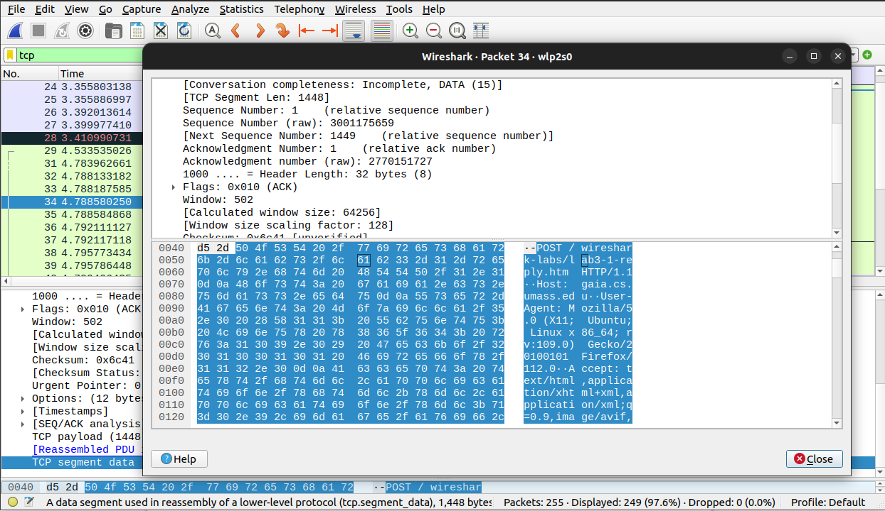

# Практика 7. Транспортный уровень

## 1. Wireshark: TCP
Перехват TCP-передачи данных от вашего компьютера удаленному серверу.

### 1. Какой IP-адрес и номер порта TCP использует ваш компьютер (отправитель), передающий файл серверу gaia.cs.umass.edu? 
**Мой компьютер:**  
IP: 192.168.0.105  
PORT: 53500  

### 2. Каков IP-адрес у сервера gaia.cs.umass.edu? Каковы номера портов для отправки и приема TCP-сегментов этого соединения? 
**Сервер:**  
IP: 128.119.245.12  
PORT: 80

### 3. Какой порядковый номер у SYN TCP-сегмента, который используется для установления TCP-соединения между компьютером клиента и сервером gaia.cs.umass.edu? Как определяется, что это именно SYN-сегмент? 

Sequence Number: 0   
Чтобы определить, что это именно SYN-сегмент, нужно обратить внимание на флаги в заголовке TCP.

### 4. Какой порядковый номер у SYN ACK-сегмента, отправленного сервером gaia.cs.umass.edu на компьютер клиента в ответ на SYN-сегмент? Какое значение хранится в поле подтверждения в SYNACK-сегменте? Как сервер gaia.cs.umass.edu определил это значение? Как определяется, что это именно SYNACK-сегмент? 

Sequence Number: 0  
Acknowledgment Number: 1  

Значение подтверждения в SYN ACK-сегменте определяется путем увеличения порядкового номера из SYN-сегмента на единицу.

Опять же смотрим на флаги в заголовке TCP. В SYN ACK-сегменте устанавливаются два флага: SYN и ACK. 

### 5. Какой порядковый номер у TCP-сегмента, содержащего команду POST протокола HTTP? (для нахождения команды POST вам потребуется проникнуть внутрь поля содержимого пакета в нижней части окна Wireshark, чтобы найти сегмент, в поле DATA которого хранится значение POST) 

Sequence Number: 1

### 6. Рассмотрите TCP-сегмент, содержащий команду POST протокола HTTP, как первый TCP сегмент соединения. Какие порядковые номера у первых шести сегментов TCP соединения (включая сегмент, содержащий команду POST протокола HTTP)? Когда был отправлен каждый сегмент? Когда был получен ACK-пакет для каждого сегмента? Покажите разницу между тем, когда каждый TCP-сегмент был отправлен и когда было получено каждое подтверждение, чему равно значение RTT для каждого из 6 сегментов? 
Номера: 1, 1449, 2897, 4345, 5793, 7241
Sequence Number : Time since first frame in this TCP stream  
1    - 0.254652559 seconds
1449 - 0.255049842 seconds
2897 - 0.258576101 seconds
4345 - 0.258582092 seconds
5793 - 0.262238408 seconds
7241 - 0.262251422 seconds

### 7. Чему равна пропускная способность (количество байтов, передаваемых в единицу времени) для этого TCP-соединения? Объясните, как вы получили это значение. 
