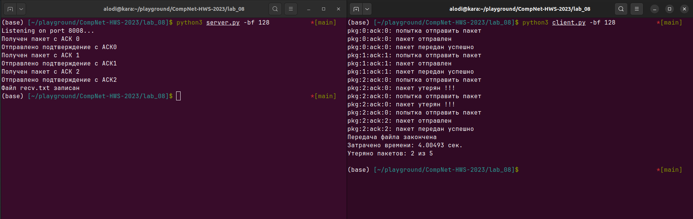

# Практика 8. Транспортный уровень 

## 1. Реализация протокола Stop and Wait

### А. Общие требования (5 баллов)

Запустим `server.py` и `clinet.py` для передачи файла:
```
>> python3 server.py -bf 128
>> python3 client.py -bf 128
```



## Задачи

### Задача 1 (2 балла)
**Условие:** Пусть T (измеряется в RTT) обозначает интервал времени, который TCP-соединение тратит на
увеличение размера окна перегрузки с W/2 до W, где W – это максимальный размер окна
перегрузки. Докажите, что T – это функция от средней пропускной способности TCP. 

Средняя пропускная способность TCP-соединения $V_m$ = $\frac{3}{4} \frac{W}{RTT} Байт/сек$ $ \Rightarrow  RTT = \frac{3}{4} \frac{W}{V_{m}}$
А т.к у нас по условию T измеряется в RTT, то мы можем переписать это равенство:  $RTT = \frac{3}{4} \frac{W}{V_{m}} \Rightarrow T = \frac{3}{4} \frac{W * const}{V_{m}}$. Таким образом мы получили, что T это действительно функция от средней пропускной способности TCP (как и было сказано на слайдах, собственно).

