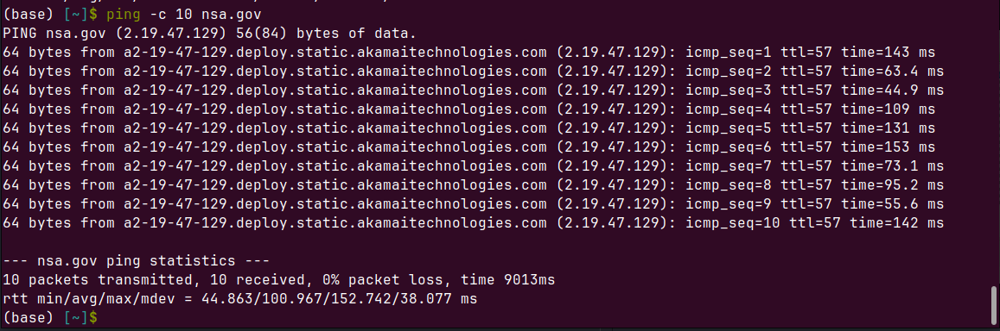

# Практика 9. Сетевой уровень

## Wireshark: ICMP 


### 1. Ping 
Для пингования выберем **National Security Agency, США**. Начнём захват пакетов в wireshark и запустим программу ping комадной `ping -c 10 nsa.gov`:



Результат:


1. **Каков IP-адрес вашего хоста? Каков IP-адрес хоста назначения?**  
    Мой IP-адрес: 192.168.0.105   
    IP-адрес хоста назначения: 2.19.47.129

2. **Почему ICMP-пакет не обладает номерами исходного и конечного портов?**  
ICMP не является протоколом транспортного уровня, поэтому в нём нет атрибута портов.

3. **Рассмотрите один из ping-запросов, отправленных вашим хостом. Каковы ICMP-тип и кодовый номер этого пакета? Какие еще поля есть в этом ICMP-пакете? Сколько байт приходится на поля контрольной суммы, порядкового номера и идентификатора?**  
Type: 8 (Echo (ping) request)  
Code: 0  
**Другие поля:**  
```
Checksum: 0x4f96 [correct]       | 2 байта  
Identifier (BE): 20 (0x0014)     | 2 байта
Sequence Number (BE): 1 (0x0001) | 2 байта
Timestamp from icmp data: Apr 27, 2023 13:49:50.000000000 MSK  
[Timestamp from icmp data (relative): 0.182896109 seconds]  
Data (48 bytes)  
```

4. **Рассмотрите соответствующий ping-пакет, полученный в ответ на предыдущий. Каковы ICMP-тип и кодовый номер этого пакета? Какие еще поля есть в этом ICMP-пакете? Сколько байт приходится на поля контрольной суммы, порядкового номера и идентификатора?**  
Type: 0 (Echo (ping) reply)  
Code: 0  
**Другие поля:**
```
Checksum: 0x5796 [correct]
Identifier (BE): 20 (0x0014)
Sequence Number (BE): 1 (0x0001)
[Response time: 142,973 ms]
Timestamp from icmp data: Apr 27, 2023 13:49:50.000000000 MSK
Data (48 bytes)
```
Как видим, добавляется поле `Response time`

## Программирование 

### 1 и 2: программа для вывода своего IP и маски подсети и программа для проверки доступных портов

Результат работы:

