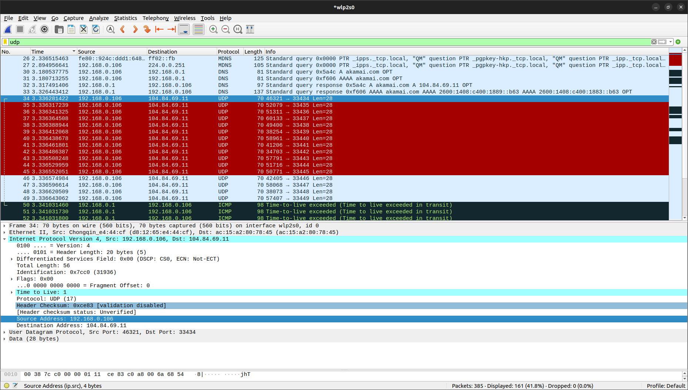
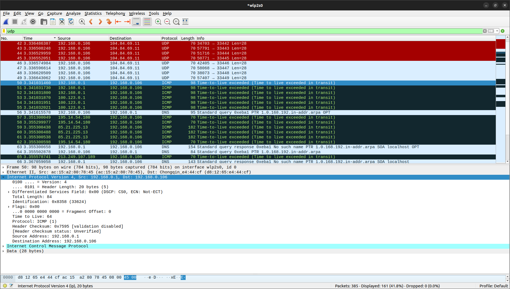
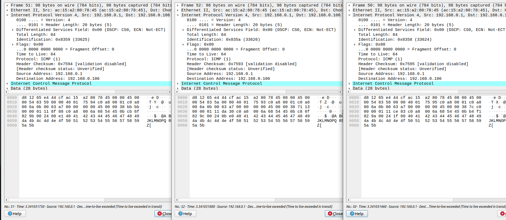

# Практика 10. Сетевой уровень

## Wireshark. IP

### 1. Выберите первое ICMP-сообщение эхо-запроса, отправленное вашим компьютером, и раскройте часть информации о пакете Internet Protocol в окне подробной информации. Каков IP-адрес вашего компьютера? 

**Source Address:** 192.168.0.106

### 2. Найдите заголовок IP-пакета. Какое значение указано здесь в поле протокола верхнего уровня?
**Protocol:** UDP (17)

### 3. Сколько байт в IP-заголовке? Сколько байт приходится на полезную нагрузку IP дейтаграммы? 
Всего в заголовке **20 байт**. Полезная нагрузка составила **36 байт**

### 4a. Какие поля IP-дейтаграммы всегда изменяются от одной дейтаграммы к следующей в рамках одной последовательности ICMP-сообщений, отсылаемых компьютером (последовательность – это все сообщения, которые отправляются до конечного хоста)? 

Меняются поля: `Identification`, `Header Checksum` и `Time to live`

### 4b. Какие поля не меняются? Какие поля должны оставаться неизменными? Какие поля должны изменяться? (в рамках одного запуска утилиты) 
Не меняются поля: `Version`, `Header Length`, `Flags`, `Differentiated Services Field`

### 4c. Как изменяется значение поля Identification IP-дейтаграммы с каждым последующим эхо-запросом? Есть ли какая-либо закономерность? 
С каждым последующим запросом значение поля увеличивается на 1, но иногда происходит и большее увеличение (когда меняется `IP destination`)

### 5. Какое значение содержится в поле Identification (Идентификация), а какое – в поле TTL (выберите какой-либо один пакет ICMP)? 

Поле `Identification` нужно для идентификации уникальности фрагмента IP-дейтаграммы, поле занимает 2 байта.  

Поле `TTL` - время жизни пакета 

### 6. Остаются ли эти значения (Identification и TTL) неизменными во всех сообщениях протокола ICMP, где содержится информация об истечении предписанного времени жизни; рассмотрите только те из таких сообщений, которые поступили на компьютер с ближайшего (первого транзитного) маршрутизатора. 
У всех сообщений `TTL` одинаковый и равняется 64. `Identification`, очевидно, меняется. 

### 7. Найдите серии откликов ICMP, в которых содержатся сообщения об истечении предписанного времени жизни (time-to-live exceeded). Выберите один из пакетов. Какое значение содержится в поле Identification (Идентификация), а какое – в поле TTL?
Identification: 0x0000 (0)   
Time to Live: 248
