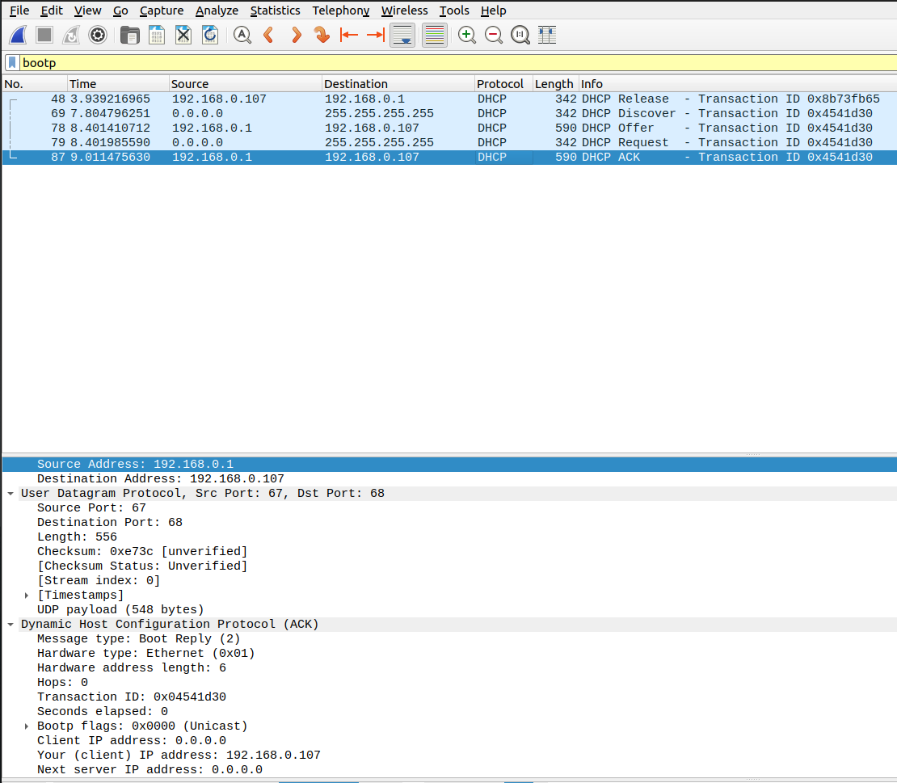
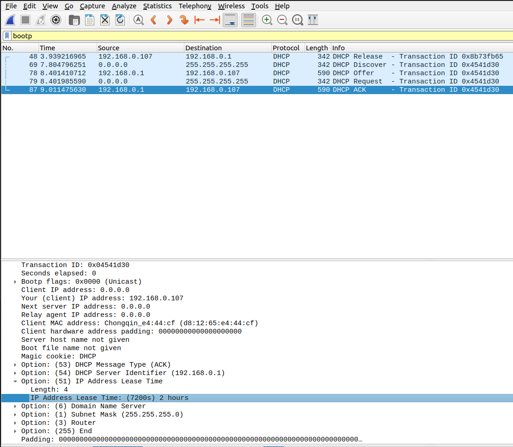
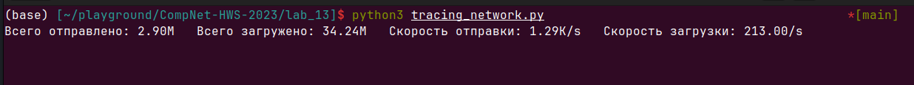

# Практика 13. Канальный уровень

## 1. Wireshark : DHCP

**Подготовка на линуксе:**  

Высвободим IP-адрес: `sudo dhclient -r`   
И получим новый: `sudo dhclient`

### 1. Поверх какого протокола посылаются сообщения DHCP – UDP или TCP? 
Сообщение посылаются поверх **UDP**:

### 2. Каков адрес канального уровня (т.е., Ethernet-адрес) у вашего хоста? 
Адрес канального уровня у моего хоста: `d8:12:65:e4:44:cf`  

### 3. Каковы значения Transaction-ID в наборе (Request/ACK) DHCP-сообщений? Опишите назначение поля Transaction-ID. 
**Transaction ID: 0x04541d30.** Сервер использует Transaction-ID для идентификации соответствующей транзакции при отправке ответного сообщения клиенту. Также сервер использует Transaction-ID для отслеживания и предотвращения повторных запросов.  

### 4. Хост использует DHCP-протокол, в частности, для получения IP-адреса. Но IP-адрес хоста остается неподтвержденным до завершения обмена DHCP сообщениями. Если IP-адрес не установлен до завершения обмена сообщениями, то какие значения используются в IPдейтаграммах при обмене этими сообщениями? Укажите исходный и конечный IP-адреса, передаваемые в инкапсулирующей IP-дейтаграмме DHCP сообщений 

Исходный IP-адрес будет 0.0.0.0. Это значение представляет неподтвержденный IP-адрес.  Конечный IP-адрес 255.255.255.255 - значит сообщение будет доставлено всем устройствам в локальной сети.

### 5. Каков IP-адрес вашего DHCP-сервера?
У меня 192.168.0.1

### 6.Объясните назначение срока аренды IP-адреса. Какова длительность срока аренды в вашем эксперименте?   
Это позволяет избежать неэффективного использования адресного пространства и обеспечивает его рациональное распределение (Если клиент долго не обновляет аренду IP-адреса, сервер DHCP может освободить этот адрес и назначить его другому клиенту)

Конкретно мне выдали IP на стандартные 2 часа

## Программирование

### Подсчет сетевого трафика A (2 балла)
**Реультат работы программы:**

